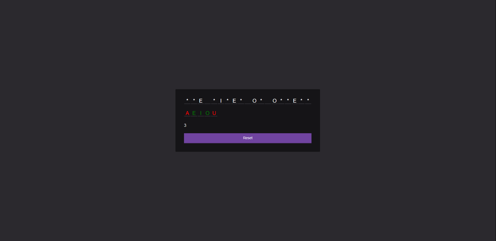

# hangman-ajax-app
Un tradicional juego del ahorcado, tienes que adivinar la pelicula

## Tabla de contenido
- [Empezamos](#Empezamos)
	- [El reto](#El-reto)
	- [Screenshot](#Screenshot)
	- [Links](#Links)
- [Proceso de creación](#Proceso-de-creación)
	- [¿Que he aprendido?](#¿Que-he-aprendido?)
	- [Kaizen o Desarollo Continuado](#Kaizen-o-Desarollo-Continuado)
	- [Recursos útiles](#Recursos-útiles)
- [Autor](#Autor)

## Empezamos
### El reto
Los usuarios deben ser capaces de:
- Introducir letras, numeros y algunos simbolos con el teclado.
- Si uno de los caracteres coincide con el titulo se nos muestra.
- Si el usuario se equivoca su numero de intentos baja.
- Si el usuario Gana suena un sonido de victoria y se carga el poster de la pelicula en el fondo.
- Si el usuario Pierde suena un sonido de derrota y se carga un meme en el fondo.

### Screenshot

### Links
- Codigo: [Código](https://github.com/nexus122/hangman-ajax-app)
- Demo: [Demo](https://nexus122.github.io/hangman-ajax-app/)

## Proceso de creación
### ¿Con que esta hecho?
- Semantic HTML5 markup
- CSS custom properties
- Flexbox
- Javascript
	- Fetch

### ¿Que he aprendido?
Hemos aprendido a utilizar fetch para hacer peticiones tanto externas como internas, yo estaba acostumbrado a utilizar jquery y su función de ajax, pero fetch lo vuelve inecesario.

Petición de nombre de la pelicula.
```js
async function randomPhrase(){

let resp = await fetch('./data/films.json');

resp = await resp.json();

let index = Math.floor(Math.random() * resp.length);

console.log(resp[index].title);

return resp[index].title;

}
```

Petición del poster al ganar
```js
async function getPoster(title){

const url = `https://api.themoviedb.org/3/search/movie?api_key=f67a8ad780c75b59b2e185315b4e7818&language=en-US&page=1&include_adult=false&query=${title}`;

const path_to_images = 'https://image.tmdb.org/t/p/original'

let resp = await fetch(url);

resp = await resp.json();

let imageUrl = path_to_images+'/'+resp.results[0].poster_path;

return imageUrl;

}
```

### Kaizen o Desarollo Continuado
- Me interesa profundizar mas en el codigo asincrono y en las peticiónes a las apis
- Me interesa profundizar en la modulizacion del javascript
- Tengo pendiente una refactorización para separar aun mas el código.

### Recursos útiles
- [Uso de Fetch](https://developer.mozilla.org/es/docs/Web/API/Fetch_API/Using_Fetch) Muy útil para consulta.
- [Función async](https://developer.mozilla.org/es/docs/Web/JavaScript/Reference/Statements/async_function)Muy útil para consulta.

## Autor
- Website - [CV online](http://juanpabloromeropereira.es/)
- Linkedin - [Linkedin](https://www.linkedin.com/in/juan-pablo-romero-pereira-523996101/)
- Github - [@nexus122](https://github.com/nexus122)
